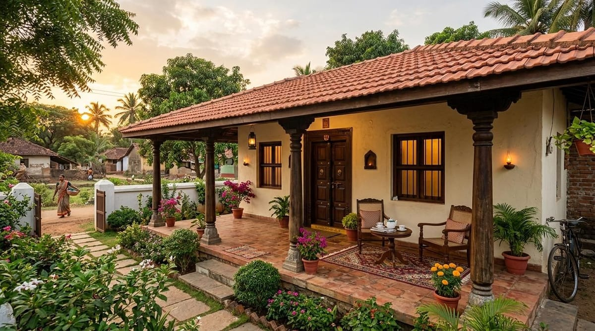
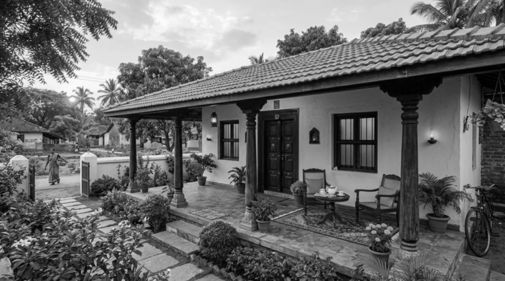
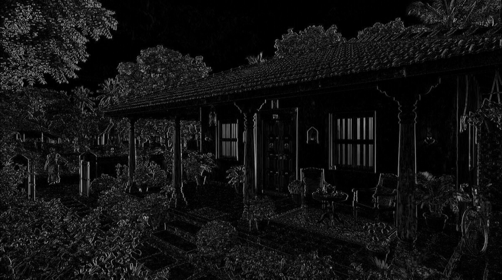
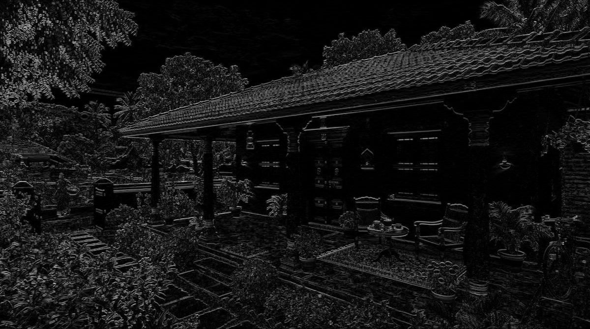
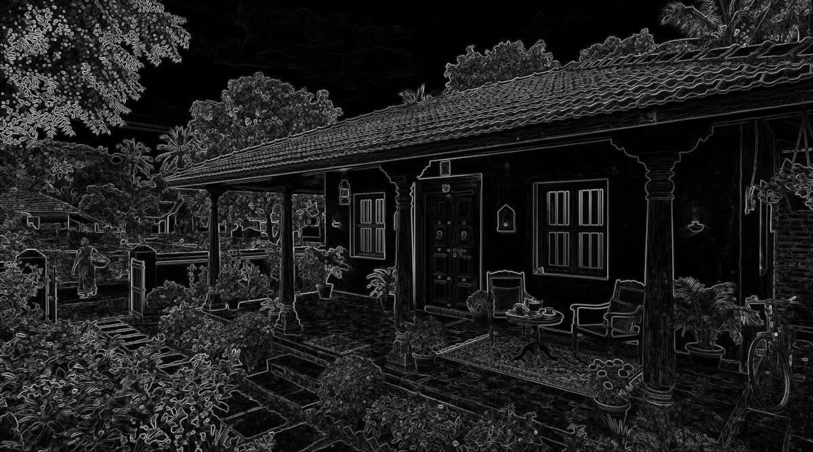
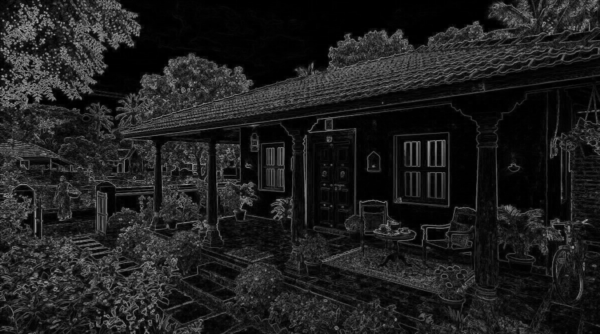
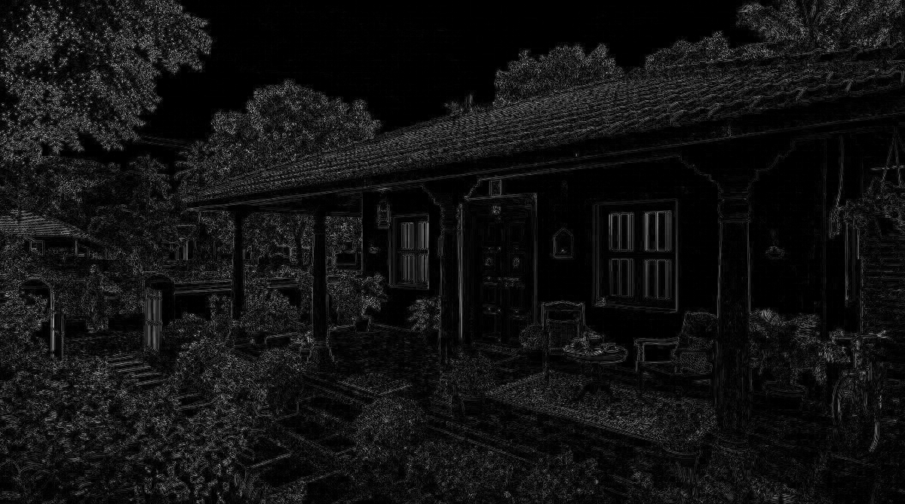
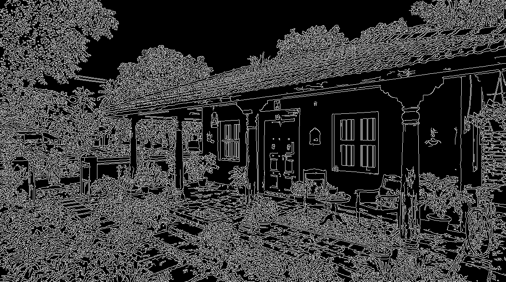

# Image Processing Filter Outputs

These outputs were generated using the uploaded model image `front-verandah-simple-village-house-design_0_1200.jpg`.

## Results

### Original Input

### Grayscale

### Mean Filter

### Gaussian Filter

### Median Filter

### Sobel X

### Sobel Y

### Sobel Magnitude

### Prewitt X

### Prewitt Y

### Roberts Cross

### Laplacian

### Canny Edge Detection

